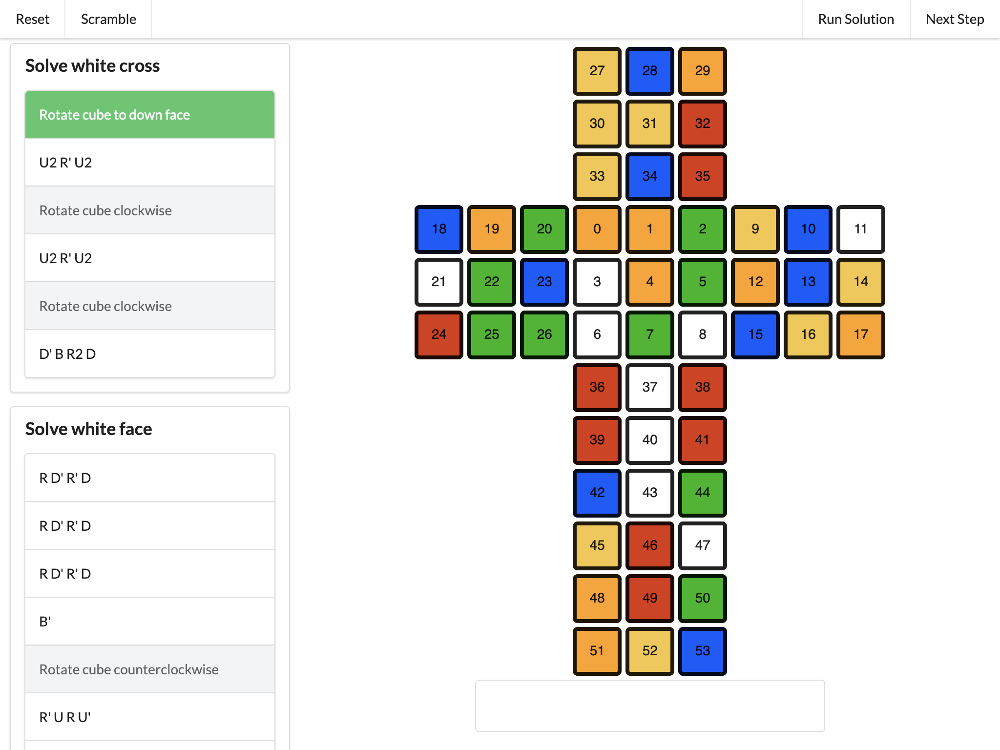

# Rubix

A browser-based Rubik's cube visualizer and solver.

The solver works in 7 main steps:

1. Solve white cross
2. Solve white face
3. Solve second layer
4. Solve yellow cross
5. Solve yellow face
6. Solve yellow corners
7. Solve yellow edges

This is an old project of that I worked on in college. Note that this does not produces optimal solutions (there are much more sophisticated techniques for that), but rather uses common algorithms to solve the cube sequentially. It's more of a reference tool for someone looking to solve a cube by hand.
